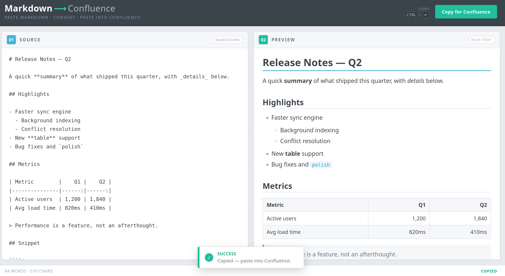

# Markdown → Confluence

A single, self-contained HTML page that converts Markdown into rich text you can paste straight into a Confluence page — headings, lists, tables, code blocks and all.

## Usage

1. Open `index.html` in a browser (double-click it — no server, no install, works offline from `file://`).
2. Paste your Markdown into the left panel. The right panel shows a live preview.
3. Click **Copy for Confluence** (or press `Ctrl`/`Cmd` + `Enter`).
4. Paste into the Confluence editor. Formatting is preserved.

## What it converts

- Headings (`#` … `######`)
- **Bold**, *italic*, ~~strikethrough~~
- Inline `code` and fenced code blocks
- Bullet and numbered lists, including nested lists
- Tables (GitHub-style pipe tables, with column alignment)
- Blockquotes
- Links
- Horizontal rules

## How it works

The page parses Markdown into semantic HTML and writes it to the clipboard as a
`ClipboardItem` carrying both `text/html` (rich text) and `text/plain` (the raw
Markdown). Confluence's editor reads the `text/html` flavour on paste and maps it
onto its own elements. Browsers without the async Clipboard API fall back to a
`contentEditable` + `execCommand` copy.

Everything — parser, styles, logic — lives in `index.html`. There is no build
step and no runtime dependency.

## Limitations

- The emitted HTML is clean semantic markup but may need tuning against the real
  Confluence editor; nested lists and tables are the most likely spots to adjust.
- Fonts use system stacks rather than web fonts, to keep the page fully offline.
